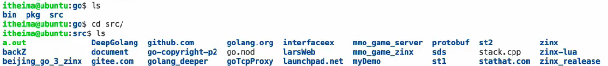
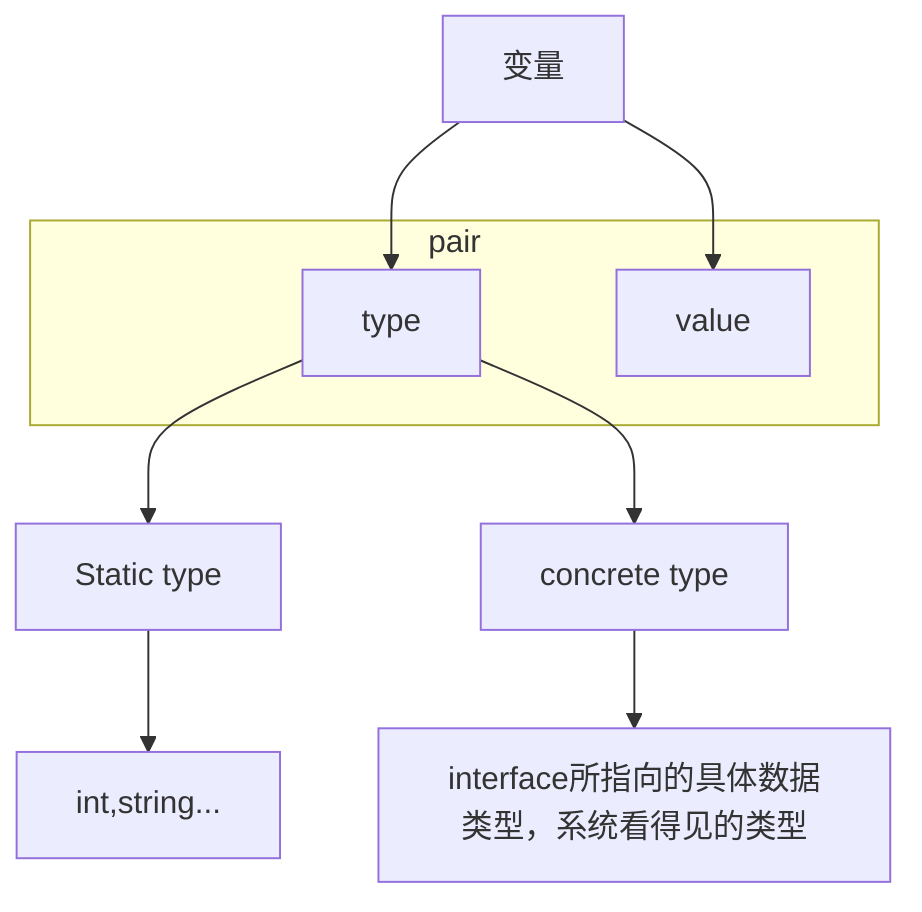

# golang学习笔记
## go的前置学习
### go安装
选择镜像：https://golang.google.cn/dl/
### go源码包结构
1. go/src
go代码源码

2. go/bin
go指令源码
### 环境配置
vim ~/.bashrc

export GOROOT=/usr/local/go

export GOPATH=/Users/wps/go

export PATH=\$PATH:\$GOROOT/bin:$GOPATH/bin

source ~/.bashrc

### 验证
go version
### 验证环境变量
echo $GOROOT

echo $GOPATH

echo $PATH

### 项目构建
在go/src下构建项目文件夹：GolangStudy/firstGolang

## go语法
### 代码结构
```
//分号可选（默认不使用）
package main //程序包名
import (
    "fmt"
    "time"
    //导入多个包
)
//main函数
func main() { //方括号一定在同一行
    fmt.Println("Hello World!") //外部可用函数首字母一定大写

    time.Sleep(1 * time.Second)
}

/*
这是注释
*/

```

### golang编译
1. 编译
```
golang build 项目名.go
```
生成.exe可执行文件。
2. 编译并运行
```
go run 项目名.go
```
 
### 四种变量声明方式

```
//方法一：声明一个变量，默认为0
var a int

//方法二：初始化一个值
var b int = 100

//方法三：自动匹配
var c = 100

//方法四：自动推导
d := 100

//打印类型
fmt.Printf("%T", d)
```

### const与iota
可用于const下的递增枚举
```
const (
    a = iota    //0
    b           //1
    c           //2
    d = iota * 2 + 1    //3 * 2 + 1 = 7
)
```

### 多返回值三种写法
```
//方法一：匿名
func test1(a string, b int) (int, int) {
    c := 100
    d := 200
    return c, d
}

//方法二：非匿名
func test2(a string, b int) (r1 int, r2 int) {
    r1 = 100
    r2 = 200
    return
}

//方法三： 
func test3(a string, b int) (r1, r2 int){
    r1 = 100
    r2 = 200
    return
}
```

### 导包路径和init方法调用
1. 执行顺序
    1. import pkg1(递归解析)
    2. const ...
    3. var ...
    4. init() ...
    5. main() ...
    6. Exit

2. 示例多包结构
\$GOPATH/GolangStudy/5-init/
* lib1
    * lib1.go
* lib2
    * lib2.go
* main.go
```
//lib1.go
package lib1
import "fmt"

func Lib1Test() {
    fmt.Println("lib1Test")
}

func init() {
    fmt.Println("lib1 init")
}
```

```
//lib2.go
package lib2
import "fmt"

func Lib2Test() {
    fmt.Println("lib2Test")
}

func init() {
    fmt.Println("lib2 init")
}
```

```
package main
import (
    // 未使用module管理前导入相对路径
    "GolangStudy/5-init/lib1"
    "GolangStudy/5-init/lib2"
)

func main() {
    lib1.Lib1Test()
    lib2.Lib2Test()
}
```

执行结果：先init后Test

### import匿名与别名导包
不使用lib1函数但是想执行内部init方法：匿名导包
```
package main
import (
    // 未使用module管理前导入相对路径
    _ "GolangStudy/5-init/lib1" //匿名
    mylib2 "GolangStudy/5-init/lib2"  //别名
    //. "GolangStudy/5-init/lib2" -> lib2Test() 直接导入（不安全）
)

func main() {
    mylib2.Lib2Test()
}
```

### golang指针
```
func swap(pa *int, pb *int){
    var temp int
    temp = *pa
    *pa = *pb
    *pb = temp
}

// main
a := 10
b := 20
swap(&a, &b)
```

### defer语句调用顺序
defer语句在**生命周期结束**前调用，后进先出。
```
func deferfuc() int {
    fmt.Println("defer func called")
    return 0
}

func returnfuc() int {
    fmt.Println("return func called")
    return 0
}

func returnAndDefer() int {
    defer deferfuc()
    return returnfuc()
}

func main() {
    returnAndDefer()
}

输出内容：
defer func called
return func called
```

### 数组
1. 定义数组
```
//方法一：指定长度
var a [5]int

//方法二：根据元素个数推断长度
b := [3]int{1, 2, 3}

//遍历
for i := 0; i < len(b); i++ {
    fmt.Println(b[i])
}

for index, value := range b {
    fmt.Println(index, value)
}

//传参时必须传递完整（值传递）
func printA(a [5]int) {
    fmt.Println(a)
}
```
2. 定义slice
```
//方法一：初始化
a := []int{1, 2, 3, 4}

//方法二：申请
var a []int
a = make([]int, 4)

//方法三：声明并申请
var a []int= make([]int, 4)

//方法四：方法三简写
a := make([]int, 4)
```

3. slice切片与截取
```
//申请时可传参：len,cap
// len:3 cap:5
var a = make([]int, 3,5)
fmt.Printf("len = %d, cap = %d\n", len(a), cap(a))

//追加（如果容量已满，则扩容加cap）
a = append(a, 10)

//截取
a1 := a[0:2]
a1 := a[:2]
a1 := a[0:]
//类似Python方法

//拷贝
b := make([]int, 4)
copy(b, a)
```

### map
1. map的三种定义方式
```
//方法一：声明并申请
var Mymap1 map[string]string
Mymap1 = make(map[string]string, 10)

//方法二：直接申请
Mymap2 := make(map[string]string, 10)

//方法三：初始化
Mymap3 := make(map[int]string) {
    1: "java"
    2: "golang"
}

//赋值
Mymap1["YunNan"] = "KunMing"

//判空
if Mymap1 == nil {
    fmt.Println("空map")
}

//遍历
for key, value := range Mymap1 {
    fmt.Printf("key = %s, value = %s, map = %v", key, value, Mymap1)
}

//删除
delete(Mymap1, "YunNan")

//map被调用传参时是直接指针传递
```
### make和new的区别
make 和 new 都是用于内存分配的内置函数，但它们有着不同的用途和行为：
1. 适用类型
    * make：仅适用于创建 slice、map 和 channel 这三种引用类型。
    * new：用于为任何类型分配零值内存空间，返回指向该类型零值的指针。它适用于所有类型，包括结构体、基本类型（如 int、float 等）以及指针类型等。
2. 返回值
    * make：返回的是类型本身，而不是指向类型的指针。例如，make([]int, 5) 返回的是一个 int 类型的切片 []int，make(map[string]int) 返回一个 map[string]int 类型的 map，make(chan int) 返回一个 chan int 类型的通道。
    * new：返回一个指向已分配内存的指针。例如，new(int) 返回一个指向 int 类型零值（即 0）的指针 *int，new(struct { a int; b string }) 返回一个指向该结构体零值（a 为 0，b 为空字符串）的指针 *struct { a int; b string }。
3. 内存初始化
    * make：不仅分配内存，还会对创建的 slice、map 或 channel 进行初始化。
    * new：只是分配内存并将内存清零，即填充为类型的零值。例如，p := new(int)，此时 *p 的值为 0，但如果是自定义结构体 type MyStruct struct { a int; b string }，p := new(MyStruct)，则 p.a 为 0，p.b 为空字符串，并没有对结构体内部进行额外的初始化操作。

### struct
1. 定义struct
```
//类首字母大写代表其他包可以访问
type Student struct {
    name string
    number int
    age int
}

//定义方法
func (s *Student, str string) ChangeName() {
    s.name = str
}


var student1 Student
student1.name = "LiHua"
student1.age = 20

ChangeName(&student1, "LiMing")
```

2. 匿名struct
```
point := struct {
    x, y int
}{
    x: 10,
    y: 20,
}

//还允许匿名字段
type Person struct {
    string
    int
}

func main() {
    p1 := Person{"LiMing", 20}
    fmt.Println(p1)
}
```

### 深浅拷贝
```
type Person struct {
    Name string
    Age  int
    Friends []string  // 切片是引用类型
}

// 浅拷贝
p1 := Person{Name: "Alice", Age: 30, Friends: []string{"Bob"}}
p2 := p1  // p2和p1共享Friends切片

// 深拷贝
p3 := Person{
    Name: p1.Name,
    Age: p1.Age,
    Friends: make([]string, len(p1.Friends)),
}
copy(p3.Friends, p1.Friends)
```

### 空struct的使用
1. 节省内存
只关心某个元素是否存在于集合中，而不需要存储关于该元素的任何额外数据时，空结构体非常有用。
例如，在一个需要判断一组唯一标识符是否存在的场景中，可以使用 map 结合空结构体来实现。

```
package main

import (
    "fmt"
)

func main() {
    // 使用map和空结构体来表示集合
    uniqueIDs := make(map[string]struct{})
    id1 := "123"
    id2 := "456"

    // 将ID添加到集合中
    uniqueIDs[id1] = struct{}{}
    uniqueIDs[id2] = struct{}{}

    // 检查ID是否存在
    if _, exists := uniqueIDs["123"]; exists {
        fmt.Println("ID 123 exists in the set.")
    }
}
```

2. 信号传递
在通过channel进行通信时，空结构体可以作为简单的信号来传递，用于通知某个事件的发生，而不需要传递任何具体的数据。例如，在一个并发程序中，一个 goroutine 完成任务后向另一个 goroutine 发送信号。
```
package main

import (
    "fmt"
    "time"
)

func worker(done chan struct{}) {
    // 模拟工作
    time.Sleep(2 * time.Second)
    fmt.Println("Worker finished")
    // 发送完成信号
    done <- struct{}{}
}

func main() {
    done := make(chan struct{})
    go worker(done)

    // 等待工作完成信号
    <-done
    fmt.Println("Main function received done signal")
}
```

3. 实现接口
需要实现某个接口，但该接口的方法不需要访问结构体的任何字段。例如，假设存在一个 Notifier 接口，要求实现 Notify 方法，而该方法不需要任何状态信息。
```
package main

import "fmt"

type Notifier interface {
    Notify()
}

// 使用空结构体实现Notifier接口
type EmptyNotifier struct{}

func (e EmptyNotifier) Notify() {
    fmt.Println("Notification sent.")
}

func main() {
    var n Notifier = EmptyNotifier{}
    n.Notify()
}
```
### 结构体指针的使用
1. 避免空指针
```
var p *Person
// p.Name = "张三"  // 错误：panic: runtime error: invalid memory address or nil pointer dereference
```
2. 指针数组
```
persons := []*Person{
    &Person{Name: "张三"},
    &Person{Name: "李四"},
}
for _, p := range persons {
    fmt.Println(p.Name)
}
```
3. 结构体指针比较
```
p1 := &Person{Name: "张三"}
p2 := &Person{Name: "张三"}
fmt.Println(p1 == p2)      // false：比较的是指针地址
fmt.Println(*p1 == *p2)    // true：比较的是结构体的值
```


### 面向对象的类与封装
不分公有私有等继承
```
func (this *Student) Setage() {
    this.age = 18
}

stu2 := Student{
    name: "LiMing",
    number: 1001,
    age: 20,
}

stu2.Setage()
```

### 继承
```
type Bachelor Struct {
    Student
    sex string

}

func SetSex(this *Bachelor) {
    this.sex = "male"
}

bach1 := Bachelor{
    Student{
        name: "LiMing",
        number: 1001,
        age: 20,
    },
    "female"
}

var bach2 Bachelor
bach2.sex = "male"
bach2.name = "LiHua"
bach2.number = 10086

bach1.SetSex
```

### 多态
用interface实现抽象类接口
interface实现的抽象类接口本质是个指针
```
type AnimalIF interface {
    Sleep() //方法一
    GetColor() //方法二
}

type Cat struct {
    Coler string
}

//完全重写接口方法的类可以实现多态，未完全实现则不可以
func (this *Cat) Sleep() Sleep {
    time.Sleep(1 * time.Second)
}

func (this *Cat) GetColor() string{
    return this.Color
}

var animal AnimalIF
//!!用地址传递（因为是指针）
animal = &Cat("Blue")
animal.Sleep() // 调用Cat的Sleep
```

### interface空接口万能类型和类型断言
通用万能类型 interface{} 空接口
```
func Myfunc1 (arg interface{}) {
    fmt.Println("Myfunc is called.")
}

func main() {
    cat := Cat("Blue")
    Myfunc1(cat)
    Myfunc1(100)
    Myfunc1("Golang")
}

//区分传参数据类型：类型断言
func Myfunc2 (arg interface{}) {
    value, ok := arg.(string) //判断是否为string
    if !ok {
        fmt.Println("arg is not string type.")
    } else {
        fmt.Println("arg is a string type and value = ", value)
    }
}
```

### 变量的内置pair
变量结构


```
var a string

//pair<statictype:string, value:"LiHua">
a = "LiHua"

//pair<type:string, value:"LiHua" >
var allType interface{}
allType = a
```

举例
```
package main

import "fmt"

type Reader interface {
    ReadBook()
}

type Writer interface {
    WriteBook()
}

type Book struct {

}

func (this* Book) ReadBook() {
    fmt.Println("Read book.")
}

func (this* Book) WriteBook() {
    fmt.Println("Write book.")
}

func main() {
    b := &Book{}

    var r Reader
    r = b
    r.ReadBook() //调用Book的ReadBook方法

    var w Writer
    w = r.(Writer) //断言成功，如果失败会引发panic
    w.WriteBook() //调用Book的WriteBook方法
}
```

### reflect反射机制
```
package main

import{
    "fmt"
    "reflect"
}

func reflectNum(arg interface{}) {
    fmt.Println("type: ", reflect.TypeOf(arg))
    fmt.Println("value: ", reflect.ValueOf(arg))
}

func main() {
    var num float = 3.14
    reflect(num) //Type:float value:3.14
}
```

```
type User struct {
    ID int
    Name string
    Age int
}

func (this *User) Call() {

}

func main() {
    user := User(1, "LiHua", 20)
    MyFunc(user)
 }

func MyFunc(input interface{}) {
    //获取input的Type
    inputType := reflect.TypeOf(input)

    //获取input的Value
    inputValue := reflect.ValueOf(input)
    fmt.Println(inputType, inputValue)

    //通过type获取字段
    //1. 获取interface的reflect
    //2. 得到每个filed（对应一个字段），数据类型
    //3. 通过field有一个Interface()方法得到对应的value
    for i := 0; i < inputType.NumField(); i++ {
        field := inputType.Field(i)
        value := inputValue.Field(i).Interface()

        fmt.Printf("%s: %v = %v\n", field.Name, field.Type, value)
        //输出
        //ID: int = 1
        //Name: string = LiHua
        //Age: int = 20
    }

    //通过type获取方法，调用
    for i := 0; i < inputType.MethodField(); i++ {
        m := inputType.Method(i)

        fmt.Printf("%s: %v", m.Name, m.Type)
        //输出
        //Call: func(main.User)
    }
}
```

### 反射解析结构体标签Tag
```
package main

import "reflect"

type resume struct {
    Name string `info:"name" doc:"我的名字"`
    Sex string `info:"sex"` 
}

func findTag(str interface{}){
    t := reflect.TypeOf(str).Elem()

    for i:= 0; i < t.NumField(); i++ {
        tagstring := t.Field(i).Tag.Get("info")
        fmt.Println("info:", tagstring)
    }
}

func main() {
    var re resume
    findTag(&re)
}
```

### JSON编码解码格式化
```
package main

import "encoding/json"

type Movie struct {
    Title string    'json:"title"' //转成json的时候key会变成标签里的内容(title)
    Year int        'json:"year"'
    Price int       'json:"rmb"'
    Actors []string 'json:"actors"'
}

func main() {
    movie := Movie("喜剧之王", 2000, 10, []string("zhouxingchi, zhangbozhi"))

    //编码过程
    jsonStr, err := json.Marshal(movie)
    if err != nil {
        fmt.Println("json marchal error", err)
        return
    }

    fmt.Println("jsonStr = %s\n", jsonStr)

    //格式化JSON输出，将Movie结构体转换为格式化的JSON格式的字节切片
    jsonData, err1 := json.MarshalIndent(movie, "", " ")
    if err1!= nil {
        fmt.Println("Error:", err1)
        return
    }
    // 输出格式化的JSON数据
    fmt.Println(string(jsonData))

    //解码过程
    //jsonStr = {"title":"喜剧之王", "year":2000,"rmb":10, "actors":["zhouxingchi, zhangbozhi"]}
    myMovie := Movie{}
    err = json.Unmarshal(jsonStr, &myMovie)
    if err != nil {
        fmt.Println("json unmarshal error", err)
        return
    }

    fmt.Printf("%v\n", myMovie)
}
```

### goroutine基本模型和调度设计
1. 复用线程
    1. work stealing机制（process空闲从其他本地队列中偷取任务执行）
    2. hand off机制（process中协程阻塞，将阻塞任务与线程绑定，并会唤醒新的的线程和process，接管阻塞队列中任务）
2. 利用并行
GOMAXPROCS 限定P的个数 = CPU核数/2
3. 抢占
goroutine任务调度变成时间片轮转
4. 全局G队列
本地队列为空从全局队列中拉取任务（需要加锁和解锁）

### 创建goroutine
```
package main

import "fmt"
//从goroutine
func newTask() {
    i := 0
    for {
        i++
        fmt.Printf("new Goroutine : i = %d\n", i)
        time.Sleep(1 * time.Second)
    }
}

//看作main-goroutine
func main() {
    //创建一个go程执行newTask()流程
    go newTask()

    i := 0
    for {
        i++
        fmt.Printf("main goroutine: i = %d\n", i)
        time.Sleep(1 * time.Second)
    }
}
//两个go程会并发执行，主goroutine退出后所有从goroutine会全部死亡
```

```

package main

import {
    "fmt"
    "time"
}

func main() {
    //匿名goroutine
    go func() {
        defer fmt.Println("A.defer")

        func() {
            defer fmt.Println("B.defer")
            runtime.Goexit() //一次性从子函数和go程全部退出
            fmt.Println("B")
        }() //加()表示调用

        fmt.Println("A")
    }

    //有参版本
    go func2(a int, b int) bool {
        fmt.Println("a = ", a, "b = ", b)
    }(10, 20)
    for {
        time.Sleep(1 * time.Second)
    }
}
```

### channel通信机制
无缓冲和有缓冲channel都具有同步能力（双方都可能阻塞）
```
package main
import "fmt"
func main() {
    //定义channel
    c := make(chan int) //无缓冲
    d := make(chan int, 3) //有缓冲且容量为3
    fmt.Println("len(c) = ", len(c), "cap(c) = ", cap(c))

    go func() {
        defer fmt.Println("goroutine结束")
        fmt.Println("goroutine正在运行")
        c <- 666 //读未就绪则阻塞
    }()

    num := <-c //写未就绪就阻塞
    fmt.Println("num = ", num)
    fmt.Println("main goroutine结束")
}
```

```
package main
import "fmt"
func main() {
    go func2() {
        defer fmt.Println("子go程2结束")

        for i := 0; i < 3; i++ {
            d <- i
            fmt.Println("子go程2正在运行，i = ", i, len(d), "cap(d) = ", cap(d))
        }
        //close可以关闭一个channel
        close(d)
    }()

    //主go程中检查关闭，如果未执行close会导致if中一直阻塞读导致死循环，主动关闭可置ok为false
    for {
        //ok如果为true则未关闭，如果为false则已经关闭
        if data, ok := <-d; ok {
            fmt.Println(data)
        } else {
            break
        }
    }

    time.Sleep(2 * time.Second) //等待两秒把缓冲区塞满

    for i := 0; i < 3; i++ {
        num := <-d //不能有空格
        fmt.Println("num = ", num)
    }
}
```
注意事项

1. 确保没有任何需要发送的数据，或想显式结束range，再关闭channel
2. 向关闭后的channel发送数据会引发panic
3. 可以从关闭后的channel接收数据
4. 对于nil channel，收发都会阻塞

### channel和range
```
package main
import "fmt"
func main() {
    c := make(chan, int)
    go func() {
        defer fmt.Println("子go程2结束")

        for i := 0; i < 3; i++ {
            c <- i
        }
        close(d)
    }()

    /*
    for {
        //ok如果为true则未关闭，如果为false则已经关闭
        if data, ok := <-c; ok {
            fmt.Println(data)
        } else {
            break
        }
    }
    */

    //可用range不断迭代channel
    for data := range c {
        fmt.Println(data)
    }

    fmt.Println("main finished.")
}
```

### channel和select
多路复用->selet轮询监控多个channel
```
package main

import "fmt"

func fibonacii(c, quit chan int) {
    x, y := 1
     for{
        select {
        case c <- x:
            x = y
            y = x + y
        case <-quit:
            fmt.Println("quit")
            return
        }
    }
}

func main() {
    c := make(chan int)
    quit := make(chan int)

    //sub go
    fo func() {
        for i := 0; i < 6; i++ {
            fmt.Println(<-c)
        }

        quit <- 0
    }()

    //main go
    fibonacii(c, quit)
}
```

### Go Modules
是Go语言的依赖解决方案，发布于Go 1.11，于Go1.14推荐在生产上使用。为了淘汰GOPATH
1. GOPATH工作模式：

go env命令可查看环境变量

内含GOPATH：所有Go项目的所在路径

GOPATH结构：
* bin：存储所编译生成的二进制文件
* pkg：存储预编译的目标文件，以加快程序的后续编译速度
* src：存储所有.go文件或源代码。在编写 Go 应用程序，程序包和库时，一般会以\$GOPATH/src/github.com/foo/bar的路径进行存放。


2. GOPATH弊端

没有版本控制，无法同步一致第三方版本号，无法指定当前项目引用的第三方版本号。导致不同人开发的依赖版本可能不同且无法同步。

### GoModules模式基础环境说明
用go mod help获取参数说明
* go mod init 生成go.mod文件
* go mod download 下载go.mod文件中指明的所有依赖
* go mod tidy 整理现有依赖
* go mod graph 查看现有的依赖结构
* go mod edit 编辑go.mod文件
* go mod vendor 导出项目所有的依赖到vendor目录
* go mod verify 校验一个模块是否被篡改过
* go mod why 查看为什么需要依赖某模块
```
$ go env
GO111MLDULE="auto"
GOPROXY="https://proxy.golang.org,direct"
GONOPROXY=""
GOSUMDB=""
GOPRIVATE=""
```
1. GO111MODULE
    * auto：只要包含go.mod就启用
    * on：推荐设置，启用
    * off：不推荐设置，禁用
```
$ go env -w GO111MODULE=on
```

2. GOPROXY
    * 阿里云：https://mirrors.aliyun.com/goproxy/
    * 七牛云：https://goproxy.cn,direct

用于配置Go模块代理
```
$ go env -w GOPROXY=https://goproxy.cn,direct
```
direct用于在代理失效时回到原先的源中去下载

3. GOSUMDB

GOSUMDB用于校验，保证拉取到的模块版本数据未经过篡改。配置过GOPROXY会自动配置号GOSUMDB。

若对 GOSUMDB 的值有自定义需求，其支持如下格式：

* 格式 1：<SUMDB_NAME>+<PUBLIC_KEY>。
* 格式 2：<SUMDB_NAME>+<PUBLIC_KEY> <SUMDB_URL>。

4. GONOPROXY/GONOSUMDB/GOPRIVATE

配置私有部分，无需代理/校验，


### GoModules初始化项目
1. 开启Go Modules
```
$ go env -w GO111MODULE=on
```
又或是可以通过直接设置系统环境变量（写入对应的~/.bash_profile 文件亦可）来实现这个目的：
```
$ export GO111MODULE=on
```

2. 初始化项目

创建项目目录
```
$ mkdir -p $HOME/aceld/modules_test
$ cd $HOME/aceld/modules_test
```
执行Go modules 初始化
```
$ go mod init github.com/aceld/modules_test
go: creating new go.mod: module github.com/aceld/modules_test
```
在执行 go mod init 命令时，我们指定了模块导入路径为 github.com/aceld/modules_test。接下来我们在该项目根目录下创建 main.go 文件，如下：
```
package main

import (
    "fmt"
    "github.com/aceld/zinx/znet"
    "github.com/aceld/zinx/ziface"
)

//ping test 自定义路由
type PingRouter struct {
    znet.BaseRouter
}

//Ping Handle
func (this *PingRouter) Handle(request ziface.IRequest) {
    //先读取客户端的数据
    fmt.Println("recv from client : msgId=", request.GetMsgID(), 
              ", data=", string(request.GetData()))

    //再回写ping...ping...ping
    err := request.GetConnection().SendBuffMsg(0, []byte("ping...ping...ping"))
    if err != nil {
      fmt.Println(err)
    }
}

func main() {
    //1 创建一个server句柄
    s := znet.NewServer()

    //2 配置路由
    s.AddRouter(0, &PingRouter{})

    //3 开启服务
    s.Serve()
}
```

在\$HOME/aceld/modules_test,本项目的根目录执行
```
$ go get github.com/aceld/zinx/znet

go: downloading github.com/aceld/zinx v0.0.0-20200221135252-8a8954e75100
go: found github.com/aceld/zinx/znet in github.com/aceld/zinx v0.0.0-20200221135252-8a8954e75100
```
我们会看到 我们的go.mod被修改,同时多了一个go.sum文件.

3. 查看go.mod文件

aceld/modules_test/go.mod
```
module github.com/aceld/modules_test

go 1.14

require github.com/aceld/zinx v0.0.0-20200221135252-8a8954e75100 // indirect
```

4. 查看go.sum文件
在第一次拉取模块依赖后，会发现多出了一个 go.sum 文件，其详细罗列了当前项目直接或间接依赖的所有模块版本，并写明了那些模块版本的 SHA-256 哈希值以备 Go 在今后的操作中保证项目所依赖的那些模块版本不会被篡改。

### 改变模块依赖关系
```
go mod edit -replace github.com/aceld/zinx=github.com/aceld/zinx@v0.0.0-20200221135252-8a8954e75100
```

## Go命令行工具
### 常用命令
* go build：编译Go程序
* go run：编译并运行Go程序
* go fmt：格式化Go代码
* go test：运行测试
* go install：编译并安装Go程序
* go get：下载并安装Go包
* go mod：管理Go模块
* go env：查看Go环境变量


## 常用标准库
### fmt 标准库 - 格式化输入输出
常用函数
* fmt.Println(): 打印内容并换行
* fmt.Printf(): 格式化打印
* fmt.Sprintf(): 格式化字符串并返回
* fmt.Scanln(): 从标准输入中读取内容，直到遇到换行符
* fmt.Scanf(): 从标准输入中读取内容，根据指定的格式进行解析
* fmt.Fprintln(): 打印内容并换行到指定的输出流
* fmt.Fprintf(): 格式化打印到指定的输出流
* fmt.Fscanf(): 从指定的输入流中读取内容，根据指定的格式进行解析
* fmt.Sprint(): 格式化字符串并返回
* fmt.Sprintln(): 格式化字符串并换行返回

### time 标准库 - 时间处理
常用函数与类型
* time.Now(): 获取当前时间
* time.Date(): 创建指定时间
* time.Parse(): 解析时间字符串
* time.Format(): 格式化时间为字符串
* time.Sleep(): 休眠指定时间

### 文件操作
1. 文件打开与关闭
    * os.Open 函数
    os.Open 函数用于以只读模式打开一个文件。如果成功打开，它返回一个 *os.File 类型的文件对象和 nil 错误；否则返回 nil 文件对象和相应的错误。
    ```
    func main() {
        file, err := os.Open("test.txt")
        if err != nil {
            fmt.Println("无法打开文件:", err)
            return
        }
        defer file.Close()
        fmt.Println("文件已成功打开")
    }
    ```

    * os.OpenFile 函数
    可以指定打开模式（如只读、只写、读写等）和文件权限。
    ```
    func main() {
        file, err := os.OpenFile("newfile.txt", os.O_WRONLY|os.O_CREATE|os.O_TRUNC, 0644)
        if err != nil {
            fmt.Println("无法打开或创建文件:", err)
            return
        }
        defer file.Close()
        fmt.Println("文件已成功打开或创建")
    }
    ```
    这里，os.O_WRONLY 表示只写模式，os.O_CREATE 表示如果文件不存在则创建，os.O_TRUNC 表示如果文件存在则截断（清空）。0644 是文件权限，表示所有者有读写权限，组用户和其他用户有读权限。

2. 文件写入
    * 使用 os.File 的 Write 方法
    Write 方法接受一个字节切片作为参数，并返回写入的字节数和可能的错误。
    ```
    func main() {
        file, err := os.OpenFile("writefile.txt", os.O_WRONLY|os.O_CREATE|os.O_TRUNC, 0644)
        if err != nil {
            fmt.Println("无法打开或创建文件:", err)
            return
        }
        defer file.Close()

        data := []byte("这是要写入文件的数据")
        n, err := file.Write(data)
        if err != nil {
            fmt.Println("写入文件时出错:", err)
            return
        }
        fmt.Printf("成功写入 %d 个字节\n", n)
    }
    ```

    * 使用 os.File 的 WriteString 方法
    WriteString 方法可以直接写入字符串，而无需先将字符串转换为字节切片。
    ```
    func main() {
        file, err := os.OpenFile("writestringfile.txt", os.O_WRONLY|os.O_CREATE|os.O_TRUNC, 0644)
        if err != nil {
            fmt.Println("无法打开或创建文件:", err)
            return
        }
        defer file.Close()

        str := "使用 WriteString 写入的字符串"
        n, err := file.WriteString(str)
        if err != nil {
            fmt.Println("写入文件时出错:", err)
            return
        }
        fmt.Printf("成功写入 %d 个字节\n", n)
    }
    ```

3. 文件读取
    * 使用 os.File 的 Read 方法
    Read 方法接受一个字节切片作为参数，并返回读取的字节数和可能的错误。当到达文件末尾时，返回 0, io.EOF。
    ```
    func main() {
        file, err := os.Open("readfile.txt")
        if err != nil {
            fmt.Println("无法打开文件:", err)
            return
        }
        defer file.Close()

        data := make([]byte, 100)
        n, err := file.Read(data)
        if err != nil {
            fmt.Println("读取文件时出错:", err)
            return
        }
        fmt.Printf("成功读取 %d 个字节\n", n)
    }
    ```

    * 使用 os.File 的 ReadString 方法（结合 bufio）
    虽然 os.File 本身没有 ReadString 方法，但结合 bufio 包可以实现按字符串读取。
    ```
    func main() {
        file, err := os.Open("test.txt")
        if err != nil {
            fmt.Println("无法打开文件:", err)
            return
        }
        defer file.Close()

        scanner := bufio.NewScanner(file)
        for scanner.Scan() {
            line := scanner.Text()
            fmt.Println("读取到的行:", line)
        }
        if err := scanner.Err(); err != nil {
            fmt.Println("读取文件时出错:", err)
        }
    }
    ```

4. 文件拷贝
文件拷贝可以通过循环读取源文件并写入目标文件来实现。
```
func copyFile(src, dst string) error {
    srcFile, err := os.Open(src)
    if err != nil {
        return err
    }
    defer srcFile.Close()

    dstFile, err := os.OpenFile(dst, os.O_WRONLY|os.O_CREATE, 0644)
    if err != nil {
        return err
    }
    defer dstFile.Close()

    buf := make([]byte, 1024)
    for {
        n, err := srcFile.Read(buf)
        if err != nil && err.Error() != "EOF" {
            return err
        }
        if n == 0 {
            break
        }
        _, err = dstFile.Write(buf[:n])
        if err != nil {
            return err
        }
    }
    return nil
}

func main() {
    err := copyFile("source.txt", "destination.txt")
    if err != nil {
        fmt.Println("文件拷贝出错:", err)
    } else {
        fmt.Println("文件拷贝成功")
    }
}
```

### bufio
1. 写入操作
使用bufio.Writer。
bufio.Writer 提供了带缓冲的写入功能。它会在缓冲区满或调用 Flush 方法时，将数据写入底层的 io.Writer（如 os.File）。
```
func main() {
    file, err := os.Openfile("bufwritefile.txt", os.WRONLY|os.O_REATE|0644)
    if err != nil {
        fmt.Println("无法打开或创建文件:", err)
        return
    }

    defer file.Close()

    writer := bufio.NewWriter(file)
    data := []byte("要写入的数据")
    _, err = writer.Write(data)
    if err != nil {
        fmt.Println("写入文件时出错:", err)
        return
    }

    err = writer.Flush()
    if err != nil {
        fmt.Println("刷新缓冲区时出错:", err)
        return
    }
    fmt.Println("数据写入成功")
}
```

2. 读取操作
使用 bufio.Reader。
bufio.Reader 提供了带缓冲的读取功能。它可以按字节、按行或按指定分隔符读取数据。
```
//按字节读取

func main() {
    file, err := os.Open("bufwritefile.txt")
    if err != nil {
        fmt.Println("无法打开文件:", err)
        return
    }
    defer file.Close()

    reader := bufio.NewReader(file)
    buf := make([]byte, 5)
    _, err = reader.Read(buf)
    if err != nil {
        fmt.Println("读取时出错：", err)
        return
    }
    fmt.Println("读取到的字节：", buf)
}

//按行读取
func main() {
    file, err := os.Open("bufwritefile.txt")
    if err != nil {
        fmt.Println("无法打开文件:", err)
        return
    }
    defer file.Close()

    reader := bufio.NewReader(file)
    for {
        line, err := reader.ReadString('\n')
        if err != nil {
            break
        }
        fmt.Println(line)
    }
}
```

### 文件操作工具包
1. 使用 os.ReadFile 和 os.WriteFile
```
//os.ReadFile 函数可以一次性读取整个文件的内容：
func main() {
    // 读取整个文件
    content, err := os.ReadFile("test.txt")
    if err != nil {
        fmt.Println("读取文件失败:", err)
        return
    }

    // 将读取的内容转换为字符串并打印
    fmt.Println("文件内容:", string(content))
}

//os.WriteFile 函数可以一次性将数据写入文件：
func main() {
    data := []byte("要写入的数据")
    content, err := os.WriteFile("output.txt", data, 0644)
    if err != nil {
        fmt.Println("写入文件失败:", err)
        return
    }

    fmt.Println("文件写入成功")
}
```

### 读取目录内容
使用os.ReadDir读取目录内容
```
func main() {
    files, err := os.ReadDir(".)
    entries, err := os.ReadDir(".")
    if err != nil {
        fmt.Println("读取目录失败:", err)
        return
    }

    for _, entry := range entries {
        info, err := entry.Info()
        if err != nil {
            fmt.Println("获取文件信息失败:", err)
            continue
        }
        fmt.Println(info.Name(), info.Size(), info.IsDir())
    }
}
```

### 创建临时文件和目录
使用 os.CreateTemp 和 os.MkdirTemp 可以创建临时文件和目录。
```
func main() {
    // 创建临时文件
    tempFile, err := os.CreateTemp("", "example-*.txt")
    if err != nil {
        fmt.Println("创建临时文件失败:", err)
        return
    }
    defer os.Remove(tempFile.Name()) // 创建后记得删除
    defer tempFile.Close()

    // 创建临时目录
    tempDir, err := os.MkdirTemp("", "example")
    if err != nil {
        fmt.Println("创建临时目录失败:", err)
        return
    }
    defer os.Remove(tempDir) // 创建后记得删除

    fmt.Println("临时目录创建成功:", tempDir)
}
```

### 读取数据流
使用 io.ReadAll 读取任何实现了 io.Reader 接口的数据源
```
func main() {
    reader := strings.NewReader("这是要读取的数据")

    data, err := io.ReadAll(reader)
    if err != nil {
        fmt.Println("读取数据失败:", err)
        return
    }
    fmt.Println("读取到的数据:", string(data))
}
```

### 文件操作错误情况
1. 文件不存在
```
_, err := os.Open("不存在的文件.txt")
if os.IsNotExist(err) {
    fmt.Println("文件不存在")
}
```
2. 权限不足
```
_, err := os.OpenFile("/root/test.txt", os.O_RDWR, 0666)
if os.IsPermission(err) {
    fmt.Println("权限不足")
}
```
3. 文件已存在
```
_, err := os.OpenFile("test.txt", os.O_CREATE|os.O_EXCL, 0666)
if os.IsExist(err) {
    fmt.Println("文件已存在")
}
```

4. 路径错误
```
_, err := os.Open("/不存在的目录/test.txt")
if err != nil {
    fmt.Println("路径错误:", err)
}
```

### 文件操作错误处理
1. 错误检查函数
可以搭配switch case使用
```
func main() {
    _, err := os.Open("test.txt")

    switch {
    case os.IsNotExist(err):
        fmt.Println("文件不存在")
    case os.IsPermission(err):
        fmt.Println("权限不足")
    case err != nil:
        fmt.Println("其他错误:", err)
    default:
        fmt.Println("文件操作成功")
    }
}
```

2. 自定义错误类型
```
type FileError struct {
    Op   string // 操作类型
    Path string // 文件路径
    Err  error  // 原始错误
}

func (e *FileError) Error() string {
    return fmt.Sprintf("操作 %s 文件 %s 失败: %v", e.Op, e.Path, e.Err)
}

func ReadConfig(path string) error {
    file, err := os.Open(path)
    if err != nil {
        return &FileError{
            Op:   "读取配置",
            Path: path,
            Err:  err,
        }
    }
    defer file.Close()
    return nil
}
```

3. 错误包装与解包
使用 fmt.Errorf 和 %w 动词包装错误，保留错误链：
```
func readFileContent(path string) error {
    file, err := os.Open(path)
    if err != nil {
        return fmt.Errorf("打开文件失败: %w", err)
    }
    defer file.Close()

    data := make([]byte, 100)
    _, err = file.Read(data)
    if err != nil {
        return fmt.Errorf("读取文件内容失败: %w", err)
    }
    return nil
}

func main() {
    err := readFileContent("不存在的文件.txt")
    if err != nil {
        // 解包错误
        var pathError *os.PathError
        if errors.As(err, &pathError) {
            fmt.Printf("路径错误: %v\n", pathError.Path)
        }
        fmt.Println(err)
    }
}
```

4. 使用 defer 确保资源释放
```
func processFile(filename string) error {
    file, err := os.Open(filename)
    if err != nil {
        return fmt.Errorf("打开文件失败: %w", err)
    }
    // 立即使用 defer 确保文件关闭
    defer func() {
        if err := file.Close(); err != nil {
            fmt.Printf("关闭文件失败: %v\n", err)
        }
    }()

    // 处理文件...
    return nil
}
```

## 异常机制panic和recover
Go 语言通过defer、panic和recover三个关键字构建了一种独特的异常处理机制。
### Defer语句
包含该defer语句的函数返回时才执行。在资源释放、日志记录等场景中尤为有用。LIFO顺序调用

应用场景
1. 关闭文件
```
func ReadFile(filename string) error {
    file, err := os.Open(filename)
    if err != nil {
        return err
    }
    defer file.Close()

    //文件操作...
    return nil
}
```

2. 关闭数据库连接
```
func queryDB() error {
    db, err := sql.Open("mysql", "user:password@tcp(127.0.0.1:3300)/dbname")
    if err != nil {
        return err
    }
    defer db.Close()

    //数据库操作...
    return nil
}
```

注意事项
1. defer 的参数在 defer 语句执行时求值，而不是在实际执行时求值。
```
func main() {
    i := 0
    defer fmt.Println("deferred value:", i) // 会打印0，而不是1
    i++
    fmt.Println("current value:", i)
}
```
2. defer 在循环中的使用
```
//output:0 1 2
func wrong() {
    for i := 0; i < 3; i++ {
        defer fmt.Println(i) // 不推荐在循环中直接使用defer
    }
}

//output:2 1 0
func right() {
    for i := 0; i < 3; i++ {
        i := i // 创建新的变量
        defer func() {
            fmt.Println(i)
        }()
    }
}
```

### Panic语句
用于触发一个运行时错误，立即停止当前函数的执行，并开始回溯调用栈。panic主要用于处理真正的**异常情况**，而不是普通的**错误**。
```
func main() {
    f()
}

func f() {
    panic("发生了一个panic")
}
```

使用场景
1. 初始化失败
可能系统无法启动，需要使用panic来立即停止程序。
```
func initConfig() {
    config, err != nil {
        panic("无法加载配置文件，系统无法启动")
    }
}
```

2. 不可恢复的错误
```
import "net/http"
func startServer(port string) {
    if err := http.ListenAndServe(port, nil); err != nil {
        panic(fmt.Sprintf("服务器启动失败：%v", err))
    }
}
```

最佳实践
1. 区分错误和异常
```
func processData(data []int) error {
    if len(data) == 0 {
        return errors.New("空数据") //普通错误
    }

    if data == nil {
        panic("空指针异常") //真正的异常情况
    }

    return nil
}
```

2. 自定义panic信息
```
type CustomError struct {
    Code    int
    Message string
}

func (e *CustomError) Error() string {
    return fmt.Sprintf("错误码: %d, 信息: %s", e.Code, e.Message)
}

func process() {
    panic(&CustomError{
        Code:    500,
        Message: "严重错误",
    })
}

### Recover函数
用于捕获和处理 panic，从而阻止 panic 继续传播，使程序可以继续正常执行。**只能在 defer 函数中使用**。


